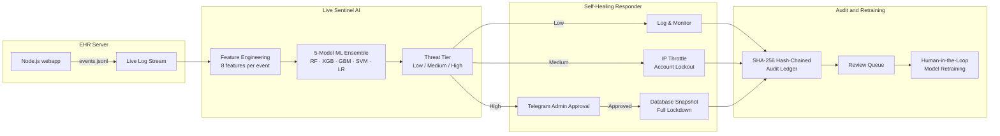

# SentiHealth

**Autonomous, zero-cloud healthcare cybersecurity — ML-driven threat detection with self-healing and human-in-the-loop authorization.**

SentiHealth monitors a live hospital EHR web server, scores every network event using a 5-model ML ensemble in real time, and automatically executes tiered self-healing responses — from IP throttling to full database snapshots — with cryptographic audit logging and Telegram-based admin approval for high-risk actions.

---

## Table of Contents

1. [Problem and Goals](#problem-and-goals)
2. [How It Works](#how-it-works)
3. [ML Ensemble Details](#ml-ensemble-details)
4. [Security Architecture](#security-architecture)
5. [Repository Layout](#repository-layout)
6. [Quickstart](#quickstart)
7. [Technologies Used](#technologies-used)
8. [Limitations and Future Work](#limitations-and-future-work)

---

## Problem and Goals

**Problem:** Hospitals are the #1 target for ransomware and data exfiltration. Existing ML-based security tools either depend on cloud infrastructure (violating HIPAA air-gap requirements) or require constant manual human review — making them too slow for millisecond-scale intrusions.

**Goals:**
- **Detect threats in real time** from live network event logs, with no cloud dependency.
- **Automate tiered responses** (throttle, lockout, snapshot) proportional to threat severity.
- **Keep humans in the loop** — High-tier threats require Telegram-based admin approval before action.
- **Leave a tamper-proof audit trail** using a SHA-256 hash-chained ledger (same cryptographic principle as blockchain).
- **Continuously improve** via a human-in-the-loop retraining queue: confirmed attacks feed directly back into the ML pipeline.

---

## How It Works

### Plain-Language Flow

1. A **Node.js EHR server** generates live network event logs (`events.jsonl`) simulating hospital web traffic.
2. **`live_sentinel.py`** tails the log stream in real time and engineers 8 features per event (failed logins, CPU usage, data export volume, lateral movement, etc.).
3. The **5-model ML Ensemble** scores each event and assigns a **Threat Tier** — Low, Medium, or High.
4. The **Self-Healing Responder** executes the appropriate automated action based on tier.
5. **High-tier events** trigger a **Telegram alert** to the admin, who must approve or reject the response before it executes (human-in-the-loop).
6. Every action is appended to a **SHA-256 hash-chained audit ledger** (`audit_chain.json`) — entries cannot be silently deleted or tampered with.
7. Admins can flag misclassified events via a **review queue**, which feeds confirmed attacks back into the retraining pipeline to continuously improve model accuracy.

### Architecture Diagram



### The Four Layers

| Layer | Component | What It Does |
|-------|-----------|--------------|
| **1 — Target** | Node.js EHR Server | Generates live network event logs simulating hospital web traffic |
| **2 — Watchdog** | `live_sentinel.py` | Tails logs, engineers features, feeds events to the ML ensemble |
| **3 — Brain** | 5-Model ML Ensemble | Scores risk and assigns Threat Tier using calibrated probability outputs |
| **4 — Responder** | `self_healing_responder.py` | Executes automated responses and manages admin approval for High-tier events |

---

## ML Ensemble Details

SentiHealth's detection core is a **weighted ensemble of 5 individually calibrated classifiers**, trained on a synthetic dataset with SMOTE resampling (to address class imbalance) and Gaussian noise injection (to simulate real-world sensor jitter).

### Features Engineered (per event)

| Feature | Description |
|---------|-------------|
| `failed_logins` | Number of consecutive failed authentication attempts |
| `cpu_usage` | Server CPU utilization spike percentage |
| `memory_spike` | Sudden memory consumption anomaly |
| `ehr_access_per_hour` | EHR record access frequency (abnormal = data exfiltration signal) |
| `lateral_movement_events` | Internal network traversal attempts |
| `data_export_volume_kb` | Outbound data transfer volume |
| `access_time_deviation` | Login time deviation from user's historical pattern |
| `source_ip_reputation` | Reputation score of the originating IP address |

### Models in the Ensemble

| Model | Role |
|-------|------|
| **Random Forest** | High recall for known attack patterns |
| **XGBoost** | Gradient boosting for structured tabular threat signals |
| **Gradient Boosting** | Sequential error correction for boundary cases |
| **SVM (RBF kernel)** | Non-linear decision boundary for complex attack signatures |
| **Logistic Regression** | Fast, interpretable baseline for Low-tier filtering |

All models use **`CalibratedClassifierCV` with isotonic regression** (5-fold) to produce reliable probability estimates for weighted ensemble voting.

### Adversarial Robustness

- **Data leakage guards** — assertions prevent `attack_type` and `tier_label` from leaking into the feature matrix.
- **Poison quarantine gate** — detects label distribution drift (an attacker approving normal traffic as attacks) and quarantines suspicious rows before retraining.
- **SHA-256 model manifest** — each saved model file is checksummed; swapped model files are detected on load.

---

## Security Architecture

```
[Node.js EHR] → [events.jsonl] → [live_sentinel.py]
    → [Feature Engineering (8 features)]
    → [ML Ensemble: RF + XGB + GBM + SVM + LR]
    → [Threat Tier: Low / Medium / High]
    → [Self-Healing Responder]
        ├── Low:    Log & continue
        ├── Medium: IP throttle + account lockout
        └── High:   Telegram approval → DB snapshot + lockdown
    → [SHA-256 Hash-Chained Audit Ledger]
    → [Review Queue → Human-in-the-Loop Retraining]
```

**Cryptographic Audit Ledger:** Every response action is appended as a hash-chained JSON entry. Each entry includes the SHA-256 hash of the previous entry, making silent log deletion or tampering cryptographically detectable — the same principle used in blockchain consensus.

**SHAP Explainability:** Every High-tier alert includes a SHAP waterfall chart explaining *which features* drove the ensemble's decision, ensuring admins can make informed approval decisions rather than blindly trusting a black-box score.

---

## Repository Layout

```
uipfinal/
├── webapp/                  # Node.js EHR server (attack target)
├── live_sentinel.py         # Core log-tailing sentinel with feature engineering
├── model_trainer.py         # 5-model ensemble training with calibration + poison guard
├── self_healing_responder.py# Tiered automated response engine
├── scoring_matrix.py        # Threat scoring and tier classification logic
├── dashboard.py             # Real-time Flask dashboard (localhost:5001)
├── review_queue.py          # Human-in-the-loop retraining queue
├── attack_scripts/          # Cyberattack simulators (exfiltration, brute-force, port scan)
├── data/                    # Synthetic EHR network event dataset
├── models/                  # Serialized calibrated model files + SHA-256 manifest
├── logs/                    # Audit chain, SHAP charts, calibration curves
├── notifications/           # Telegram Bot alerting module
├── privacy/                 # HIPAA-aligned data pseudonymisation and crypto-shredding demos
├── MODEL_METRICS.md         # Ensemble performance metrics and evaluation methodology
└── FUTURE_WORK.md           # Known limitations and planned enhancements
```

---

## Quickstart

Open **4 separate terminal windows** and run in order:

**Terminal 1 — Install & Start EHR Server:**
```bash
source setup.sh
cd webapp && node app.js
```

**Terminal 2 — Start Live Sentinel AI:**
```bash
source .venv/bin/activate
export SENTIHEALTH_TEST_MODE=1
python3 live_sentinel.py
```

**Terminal 3 — Start Live Dashboard:**
```bash
source .venv/bin/activate
python3 dashboard.py
```
> View the real-time threat dashboard at `http://localhost:5001` in your browser.

**Terminal 4 — Launch Cyberattack Simulation:**
```bash
source .venv/bin/activate
python3 attack_scripts/exfiltration.py
```

Watch the sentinel detect, classify, and respond to the live attack in real time on the dashboard.

---

## Technologies Used

| Component | Technology |
|-----------|------------|
| Core Sentinel | Python 3.10+ |
| ML Models | scikit-learn, XGBoost |
| Model Calibration | `CalibratedClassifierCV` (isotonic, 5-fold CV) |
| Class Imbalance | SMOTE (imbalanced-learn) |
| Explainability | SHAP, Matplotlib |
| EHR Target Server | Node.js, Express |
| Live Dashboard | Flask, Plotly |
| Admin Notifications | Telegram Bot API |
| Cryptography | SHA-256 HMAC (hash-chained audit ledger) |
| Privacy | Pseudonymisation, Crypto-shredding |

---

## Limitations and Future Work

| # | Limitation | Planned Enhancement |
|---|-----------|---------------------|
| 1 | Audit ledger on a single node (deletable by root attacker) | Migrate to **Hyperledger Fabric** distributed ledger |
| 2 | IP spoofing dilutes per-IP velocity metrics | IPv6 + MAC cross-referencing, session token fingerprinting |
| 3 | Telegram alerts require external internet (violates air-gap) | On-premises SMS gateway or hospital pager system (Spok) |
| 4 | Models learn only from local hospital attacks | **Federated Learning** for cross-hospital weight sharing (HIPAA-compliant) |
| 5 | Mock Node.js server, not a real EHR | **HL7 FHIR** integration (Epic, Cerner) |
| 6 | Review queue vulnerable to admin-level model poisoning | Adversarial robustness checks in retraining pipeline |

See [`FUTURE_WORK.md`](FUTURE_WORK.md) for detailed discussion of each limitation.

---

## License

MIT — see [`LICENSE`](LICENSE).
